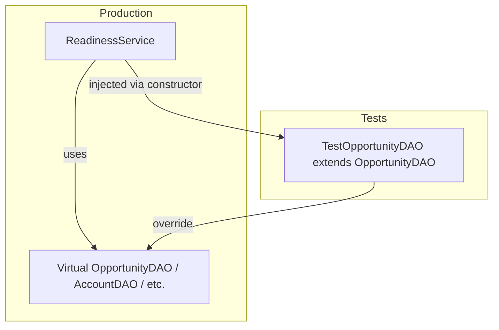

# DML Mocking Technique Overview

## Introduction: The Model

This repo uses a **virtual DAO (Data Access Object) pattern with constructor injection** to enable fast unit tests that run **without real DML or SOQL**. Tests exercise business logic in isolation by swapping real data access for in-memory mocks.

### Architecture




### Core Components

1. **Virtual inner DAO classes** – Production classes define `public virtual class OpportunityDAO` (etc.) with `virtual` methods encapsulating SOQL and DML. Example: [ReadinessService.cls](../force-app/main/default/classes/ReadinessService.cls) lines 198–273.
2. **Constructor injection** – Services expose an overloaded constructor that accepts DAO instances:
  ```apex
   public ReadinessService(OpportunityDAO oppDAO)
  ```
3. **Test mock subclasses** – Tests define `TestOpportunityDAO extends ReadinessService.OpportunityDAO` that override methods to return canned data and no-op or capture DML calls. Example: [ReadinessServiceTest.cls](../force-app/main/default/classes/tests/ReadinessServiceTest.cls) lines 435–464.
4. **In-memory SObjects** – Tests build SObjects with mock IDs using key prefixes (e.g. `Schema.SObjectType.Opportunity.getKeyPrefix() + '000000000001'`) instead of inserting records.
5. **TestDataReader** – Helper class for creating in-memory SObjects and `mockObjectId()` for unique IDs: [TestDataReader.cls](../force-app/main/default/classes/tests/TestDataReader.cls).

### Example Flow (Full Snippets)

#### 1. Scaffold of the original class

Production class holds a DAO reference and exposes two constructors: default (creates real DAO) and injection (accepts mock).

```apex
public virtual class ReadinessService {
    @TestVisible
    private OpportunityDAO opportunityDAO;
    
    // Default: real DAO
    public ReadinessService() {
        this.opportunityDAO = new OpportunityDAO();
    }
    
    // Test injection: accepts mock DAO
    public ReadinessService(OpportunityDAO oppDAO) {
        this.opportunityDAO = oppDAO;
    }
    // ...
}
```

#### 2. Method calling SOQL/DML via DAO

Service delegates all data access to the DAO—no direct `[SELECT]` or `update` in the business logic.

```apex
public void recalc(Set<Id> oppIds) {
    // SOQL – delegates to DAO
    List<Opportunity> opps = opportunityDAO.getOpportunitiesByIds(oppIds);
    // ... business logic ...

    // DML – delegates to DAO
    if (!oppUpdates.isEmpty()) opportunityDAO.dmlUpdate(oppUpdates);
}
```

#### 3. Virtual DAO (production) and Test subclass (mock)

**Production DAO** – virtual class with SOQL and DML:

```apex
public inherited sharing virtual class OpportunityDAO {
    public virtual List<Opportunity> getOpportunitiesByIds(Set<Id> opportunityIds) {
        return [
            SELECT Id, AccountId, Type, IsClosed, CloseDate, ...
            FROM Opportunity
            WHERE Id IN :opportunityIds
        ];
    }
    public virtual void dmlUpdate(List<SObject> records) { update records; }
}
```

**Test mock** – extends and overrides; returns canned data, no-ops DML, tracks calls:

```apex
private class TestOpportunityDAO extends ReadinessService.OpportunityDAO {
    private Integer callCount = 0;
    private List<Opportunity> mockData = new List<Opportunity>();
    
    public void setMockData(List<Opportunity> data) { this.mockData = data; }
    
    public override List<Opportunity> getOpportunitiesByIds(Set<Id> opportunityIds) {
        callCount++;
        return mockData;  // No SOQL – returns preconfigured list
    }
    
    public override void dmlUpdate(List<SObject> records) {
        // No DML – intentionally empty; optionally capture records for assertions
    }
    
    public Integer getCallCount() { return callCount; }
}
```

#### 4. How injection works in the test

Test builds in-memory data, configures the mock, injects it via the overloaded constructor, then asserts.

```apex
@isTest
static void testRecalcWithRenewalOpportunities() {
    // 1. Create mock and in-memory data (no insert)
    TestOpportunityDAO mockOppDAO = new TestOpportunityDAO();
    Opportunity testOpp = TestDataReader.createTestOpportunity('Test Opportunity');
    
    // 2. Configure mock to return canned data
    mockOppDAO.setMockData(new List<Opportunity>{testOpp});
    
    // 3. Inject mock – service uses it instead of real DAO
    ReadinessService service = new ReadinessService(mockOppDAO);
    
    // 4. Execute – no SOQL/DML runs; logic exercised against mock data
    Set<Id> oppIds = new Set<Id>{testOpp.Id};
    service.recalc(oppIds);
    
    // 5. Assert mock was invoked
    System.assertEquals(1, mockOppDAO.getCallCount());
}
```

---

## Advantages and Drawbacks

### Advantages

- **Fast tests** – No DML or SOQL; tests run in milliseconds, stay under governor limits.
- **Deterministic** – No shared DB state; each test is isolated; no flaky data dependencies.
- **Easy edge cases** – Nulls, duplicates, specific statuses, and rare scenarios without complex `@TestSetup`.
- **Logic isolation** – Business logic is tested without database behavior.
- **Call verification** – Mocks can count invocations and capture arguments for assertions.
- **No external dependencies** – Pure Apex; no packages or libraries.
- **Incremental adoption** – Add virtual DAOs and overloaded constructors to existing code.

### Drawbacks

- **Production design cost** – Requires virtual DAOs, injection constructors, and discipline in services.
- **Mock maintenance** – Test subclasses must stay in sync with DAO method signatures when they change.
- **No integration coverage** – Real SOQL, DML, triggers, validation rules, and FLS are not exercised.
- **Boilerplate** – Each test needs mock setup, configuration, and injection.
- **Partial coverage** – Triggers and async flows still need real DML for meaningful coverage.
- **DAOs coupled to services** – Inner classes mean selectors are not shared across services.

---

## When to Choose This Model

Use the **virtual DAO + constructor injection** approach when:

- **Brownfield or incremental** – You have existing code and cannot justify a large refactor. Add virtual DAOs and injection constructors without restructuring the whole codebase.
- **Zero dependencies** – You want no packages, no unmanaged dependencies, and no framework to maintain or upgrade.
- **Service-scoped data access** – Each service has its own queries and DML; you do not need shared Selectors reused across many services.
- **Small or mid-size teams** – You want something easy to explain and adopt without training on a framework.
- **Quick wins** – You need faster tests soon. This pattern can be applied service-by-service without a migration plan.
- **Constructor injection preference** – You prefer explicit dependencies passed in over a service locator or factory. Dependencies are visible at the call site.

**Prefer fflib** when you are greenfield or doing a major refactor, want shared Selectors and Domain logic, and are ready to adopt the full layer model and Custom Metadata bindings.

**Prefer heimdall-ltf** when you want a full framework (trigger routing, domain handlers, test taxonomy) with service locator DI and CI guardrails.

**Prefer apex-dml-mocking** when you want generic DML/SOQL abstraction, strongly typed queries, and a Factory-based approach rather than use-case-specific DAOs.

**Prefer Amoss** when you already use top-level, injectable classes (not inner classes) and want declarative mocks, spies, and verification without writing mock subclasses. Note: Amoss cannot mock inner classes, so it does not work with this repo's virtual DAO pattern as-is.

### Org maturity


| Maturity          | Typical fit                                                             |
| ----------------- | ----------------------------------------------------------------------- |
| **Early / small** | Standard `@TestSetup` + inserts; this pattern may be overkill.          |
| **Growing**       | Virtual DAO fits well—add testability without a framework.              |
| **Mature**        | Virtual DAO or apex-dml-mocking; balance speed vs. shared abstractions. |
| **Enterprise**    | Consider fflib or heimdall if you standardize on a framework org-wide.  |
